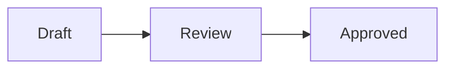

A document belongs to a project. It carries Markdown, a title, an optional
description, tags, an optional place in a series, and links to other documents;
each submission mints a new **version**, and the review UI keeps every one of
them.

Search and the status filter stay on one row, including on narrow screens.
With enlarged text, the row scrolls horizontally when needed. Keyboard focus brings each control into view.
Tag and series filters remain available when the project uses them.

## Creating

Open Documents in a project, then select **New document**.
Enter a title and Markdown.
When Board is enabled, select the cards to link.
Select **Create document**.
Loupe opens the first version with Draft status.
A draft stays out of review and the inbox.
You can edit a draft with **Revise**, and it stays a draft.
Select **Publish** to send the draft to review.
You can also review a draft with **Finish review**.

New document, Revise, and Finish review keep unsent drafts during in-app navigation in the same tab.
Closing a dialog keeps its draft. Select **Discard draft** to remove it.
Reloading or closing the browser tab discards these local drafts; copy important text first.
If another tab completes the review, the document shows your unsent review separately so you can copy or discard it.
Restored review and revision drafts retain their original version checks. They cannot silently apply to a newer version.
Documents submitted through the agent tools start with In review status, unless the agent asks for a draft.

## Revising

Select **Revise** beside the document title to edit its title and Markdown.
Enter a revision note, then select **Save new version**.
Loupe creates a version and keeps the previous version unchanged.
The Linked cards field keeps the current selection until you change it.
Clear a checkbox to remove that card link.
The picker offers open cards and keeps linked cards available after they finish.
A document with changes requested, or an approved document, returns to Needs review.
A draft stays a draft.

If another revision arrives while you edit, Loupe keeps your draft and refuses the submission.
Compare your draft with the current version before you submit a new revision.

## Reviewing

`/projects/{projectId}/documents/{documentId}/review` renders the current
version. A reviewer selects a passage, comments on it, and the comment is
anchored to the text it quotes. A comment may carry a **replacement** — what the
reviewer wants that passage to become — which the author applies by rewriting
the Markdown and submitting a new version. Loupe never edits the document
itself.

Comments, suggestions and strikes apply to the version shown on the page.
If a newer version arrives, Loupe rejects the submission and keeps the draft open.
Copy the draft before reloading, then select the passage in the current version.

Select Dismiss selection in the selection toolbar to clear the selection without posting an annotation.
Focus returns to the document. Select a passage again to annotate it.
On narrow screens, the floating review menu hides while an annotation composer is open so it cannot cover the form controls.

Threads carry a status: pending, addressed, or resolved.
Select **Finish review** in the top bar to approve the version or request changes.
A request for changes needs a review note only when the version has no open comment.
An open comment is a thread that is pending or addressed. An approval can include a note.
After a verdict, the top bar shows the verdict with **Change verdict** and **Undo**.
The saved verdict shows the reviewer, version, time and note under the title.
The account export and `document_get_review` result include the note.
Open threads do not prevent approval.

A verdict applies to the version shown when the reviewer opens the page.
If another verdict or revision arrives first, Loupe rejects the submission and keeps the note visible.
Reload the page before submitting a fresh verdict.

Select **Change verdict** in the top bar to give another verdict in one step.
The document goes straight to the new status, so a workflow never sees it in review between the two verdicts.
Select **Undo** next to it to withdraw it and reopen review.
The history retains the original verdict and its withdrawal.
If another verdict or revision arrives first, Loupe rejects the old Undo form.
Reload the page before withdrawing the current verdict.

A small toolbar in the top-right corner of the review page has three icon
buttons: **Decisions**, **Comments** and **Outline**. The Comments button shows
the number of open threads. Each button switches its panel on or off, and a
button with a light green fill shows a panel that is on.
Decisions is on when you first open a document. The other two are off.
Your browser remembers which panels you left on, and opens them on the next
document you review.

The open panels stack under the toolbar in that order: Decisions, Comments,
Outline. On a wide window they sit to the right of the text. When the open
panels are taller than the window, the panel column scrolls on its own. On a
narrower window, the toolbar and the open panels show above the document.

The Decisions panel lists every decision with its answer. Its heading counts the
answers, for example "3 of 3 answered". Each row starts with a tag such as
**D4**, then the title of the decision and its answer. The tag and the title
come from the nearest heading above the decision when that heading starts with
D and a number, such as "D4: How do we ship?". Otherwise the tag is D and the
place of the decision in the list, and the title is the question of the
decision. A green tag shows an answered decision, and a grey tag
shows one with no answer. A note shows under the answer as "Note:" and its text.
Select a row to go to its decision in the text.

The Comments panel lists each thread on two lines. The first line is the quoted
passage in grey, and the second line is the comment. General comments come
first, then the threads under **In the text** in passage order. A thread whose
passage is gone from this version sits under **No longer in the text**, with
its quote struck through. A resolved thread fades. The panel ends with **Comment on the whole
document**, which opens the composer for a general comment above the text.

A count in the margin to the right of the text marks each line that holds a
thread. Select a highlighted passage, the count beside it, or a row in the
Comments panel, to open its thread in a popover over the passage. A thread with no passage opens beside its
row. The popover shows the author, the status, the replies and a reply field,
with **Delete**, **Reply** and **Resolve**, or **Reopen** on a resolved thread.
Press Esc, or select outside the popover, to close it. A link to a thread, such
as `#comment-thread-<id>`, opens that thread when the page loads.

The Outline panel lists the sections and links to each one.
Decisions is disabled when the document has no decisions. Its tooltip says why.

The filter in the Comments panel head names the threads it shows and their count, such as "Open · 2".
Its menu shows counts for Open, Resolved, Unanchored and All.
**Open** is the default view, so a resolved thread leaves the panel as you resolve it.
Select **All** to bring it back. The filter turns purple while it hides open threads.
The selected filter stays active when you resolve or reopen a thread.
An empty result shows a message in the panel.

The **⋯** button at the end of the byline opens a menu about the document. It
lists the cards linked to the document with their type and column, the
documents it links to, and the documents that link to it, with their status.
When a kind has more than one link, the menu shows its count and the first
three links. Select **Show N more** to see the rest. The menu ends with
**Version history** and, when the document has more than one version,
**Compare versions**. The History page shows the version notes.

When the inbox is on, the review page lists the inbox items linked to the
document above it, and you can answer them there. See
[On a card page and a document page](inbox.md#on-a-card-page-and-a-document-page).

An inbox Review request names the document to review.
Submitting its verdict from the inbox or a card records the same document review as **Finish review**.
A document verdict completes all open Review requests for that document.
Questions that link the document as context stay open.
Withdrawing the verdict reopens document review and shows the withdrawal beside each completed request's original answer.
The completed requests stay closed and do not resume their agents again.

The documents list answers one question per row: does this document wait for
you? A row reads **1 thread waiting for you**, and counts up from there. A
thread waits for you when the agent marked it addressed and nobody confirmed it
yet. It also waits when it is still pending and orphaned, because nobody acted
and its anchor is gone. A pending thread that still points at real text waits
for the agent, so it adds nothing. A row with nothing waiting stays empty, which
is what makes the waiting rows easy to find.

The top bar of the review page holds the breadcrumb, the version, **Finish
review** and the global actions. The Comments panel and its toolbar button hold
the thread counts for the version on screen. Every count is a thread count, so a
reply never adds to one.

The General comments and **No longer in the text** buttons expand or collapse their groups.
Each button reports its expanded state to assistive technology.
You can reverse a panel transition with another click. Panels, dialogs, and flash
messages skip their movement when your system requests reduced motion.

### Deleted threads

Delete hides a thread and its replies from the review without changing their status.
Confirm the deletion, then a notice shows in the Comments panel.
Select **Undo** in that notice to restore the thread and its replies.
A thread restored on an older version stays read-only.

The notice is the only way back. Once you leave the page, the thread stays hidden.
There is no page that lists deleted threads, and there is no way to remove one for good.
The audit log records one thread deletion with its reply count and deletion sequence.
Deleting the project or account also removes its hidden threads.

### On a narrow screen

On narrow screens, the toolbar and the open panels appear above the document.
The corner menu also provides section navigation, version links, references and review actions.
The Comments panel shows its rows there too, and a thread opens in a popover
that stays inside the screen.
Reply opens an inline form, puts the caret in it, and preserves its draft when closed.
Select **Cancel** in that form to close it again.

A comment does not repeat its highlighted passage.
Suggestions and strikes retain the quoted text.
A thread whose passage is absent from this version also retains its quote.

Resizing the window preserves open reply forms and their drafts.

Touch works the same way as a mouse. Select a passage and the comment toolbar
appears. A highlighted passage has no hover, so a tap on one takes its place: the
passage opens its thread in a popover, and a tap on plain text closes it.

Three views help across versions:

- `/review/versions/{versionNumber}` — any earlier version as it read then.
- `/review/diff/{from}/{to}` — what changed between two versions.
- `/review/history` — every version, newest first.

Select **Version history** in the **⋯** menu to see every version in one table, newest first.
Each row shows the version, its revision note, its reviews, and **Read** and **Diff** links.
Each review shows the reviewer, verdict, note and time.
Withdrawals remain beside the original verdict. Versions without reviews say so.
History keeps the document header, with Document, Diff and History tabs to move back.
Use **Revise** or **Finish review** there to act on the current version.
The **From** and **To** picker beside the heading compares any two versions,
not only two that follow one another.

### Highlighting new text

Use the **Highlight new text** switch in the document header to see what a version added.
The switch marks every passage that this version added since the previous version.
Added text shows on a green tint, in a darker green ink for readers who cannot tell the tint apart.
Decisions and comments work as usual while the switch is on.

The switch compares the version on screen with the version before it.
On an earlier version, it compares that version with the one before that.
Text that a version only removed leaves nothing to mark.

Your browser remembers the switch. It stays on for other documents and after a reload.
The switch is off for version 1, because no earlier version exists to compare with.
It is also off when the two versions are too large to compare.
Point at the switch to read the reason.
A comparison page does not show the switch, because it already marks every change.

### What a comparison looks like

A comparison is a mode of the review page. The title, the byline, the toolbar,
the panels and **Finish review** stay where they are. Select **vN, new since
your last visit** in the byline, or **Compare versions** in the **⋯** menu, to
open one.

A tinted compare bar sits under the byline and stays in view while you scroll.
From left to right it holds **Document**, the two version pickers, the view
switch (**Rendered**, **Markdown** and **Side by side**), and the change counter
with the two jump arrows. A change of version compares the new pair at once. The
counter reads "2 of 42 changes" after a jump. `j` and `k` move between changes
as well. **Document** goes back to the current version.

The Outline panel opens while you compare, and shows how many changes each
section holds. A change before the first heading counts under no section. The
**Markdown** view shows no counts. When you leave the comparison, the panels
show as you left them on the document.

Decisions are read-only while you compare. The Decisions panel shows each answer
and says so, and a row takes you to the decision in the document, where you can
answer it. **Finish review** and the verdict chip stay in the top bar when the
comparison ends at the current version, because a verdict applies to that
version. A comparison that ends at an older version shows neither.

**Side by side** puts the two versions in two columns, the older one on the
left. Each block sits opposite the block it became, so a reworded paragraph
reads whole on both sides. Where one version has nothing, that side shows an
empty slot and the pair stays level. The rows of a table that both versions
hold stay level too, row by row in order. The change count and the jump arrows
work here too, and a jump can land in either column.

This view uses the full width for the two versions, so every panel starts
hidden. Select a toolbar button to show a panel as a column on the right, and
the two versions make room for it. This view has no Comments panel and takes no
new comment. Read or write comments on **Rendered**, or in the document itself.
On a phone the columns stack, older above newer, and each names its version.

**Markdown** compares the two sources line by line, so it shows a change the
other views cannot mark. Its Outline panel names every heading line, the removed
ones included, and a row takes you to that line.

Version selectors and diff-view buttons use the same control height.
Touch screens retain larger targets.
Comparing another pair keeps the selected view.
Equal versions show no changes and disable change navigation.
Expand **Revision notes** to read the notes for the compared revisions.

### Commenting on a diff

A diff accepts comments when its newer side is the current version. The comment
is an ordinary comment on that version, so it reads and re-anchors like every
other one.

Text the revision removed cannot be commented on, because the current version no
longer holds it, and the page says so when you select it. A diff that ends at an
older version stays read-only, because a comment made there would anchor to a
version nothing reads back.

## Revising

Submitting a new version **re-anchors** open comments onto it. A comment whose
quoted text still appears carries forward; one whose text is gone comes back
**orphaned**, because its anchor no longer exists. Rewriting the exact passage a
reviewer asked about therefore orphans that comment — normal, and not a reason
to avoid revising.

Re-anchoring copies a comment onto the new version rather than moving it, so
**comment ids do not survive a revision**. Reply to comments and mark them
addressed *before* submitting the new version, or re-read the review afterwards
and use the fresh ids. Both operations reject a stale id rather than silently
writing into a row nobody reads.

Deleted threads reject replies and status changes. The
`document_mark_comment_addressed` tool skips a deleted thread with the reason
`deleted`. Historical threads remain read-only for Reply, Resolve, and Reopen.

## Decision blocks

A document can ask the reviewer a question they answer by clicking rather than
by typing. Wrapping a list of options in a pair of HTML comments carrying an
identifier renders it as a group of radio buttons, and the answer comes back
with the review:

```markdown
<!-- decision: reset-link-host -->

Which host should an emailed reset link be built from?

1. Drop `x-forwarded-host` from `trusted_headers`
2. Generate emailed links from a pinned `default_uri`

<!-- /decision -->
```

A click on an option saves it at once. Each block also has a note field. Use it
to explain your choice, or to write your own answer with no option picked. The
**Decisions** panel counts a note with no pick as an answer. The
note saves 800 ms after you stop typing, and again when you leave the field.
**Clear choice** sits at the top right of the block, beside the "Pick one" or
"Pick any" chip. It removes the pick and keeps the note. The status line shows "Saved." or
"Cleared." after each save.

The last write wins. Loupe does not refuse a save because another answer came
first. A save from a page that shows an older version goes onto the current
version, matched by option label. The status line shows an error when the
request fails, or when the current version no longer has that decision or that
option. The note you typed stays in the field.

A stage worker reads the text of a design and its saved answers. It acts
on an answer even when the text has no `**Decided:**` line. It never revises an
approved document to record the answer.

When live updates are on, an answer saved in one tab shows in every other open
tab of the document. The status line in those tabs shows "Changed by" and the
name of the person who saved it. A block keeps your own pick and note while
your save for that block is not complete.

The author can mark the option they recommend. They end its line with
`(recommended: high)`, `(recommended: moderate)` or `(recommended: low)`:

```markdown
1. Drop `x-forwarded-host` from `trusted_headers` (recommended: moderate)
2. Generate emailed links from a pinned `default_uri`
```

Loupe removes the marker from the label and shows three stars next to that
option. High confidence fills all three, moderate fills two, and low fills one.
Hover over the stars, or move keyboard focus to them, to read the words, such
as "Recommended, moderate confidence". Only one option can carry the marker. When
more than one option carries it, Loupe shows no stars and keeps the marker text. Other
Markdown renderers show the marker as ordinary text.

The identifier is permanent. The answer is stored against the id rather than
against the words, so options can be reworded freely in a later version —
but **changing the id discards the answer**, with no error and no warning.
Treat it like a database column name.

A block can also take more than one answer. Mark every option `- [ ]` and Loupe
renders checkboxes, so the reviewer ticks any number of them:

```markdown
<!-- decision: ship-with -->

Which of these ship in the first release?

- [ ] The importer
- [ ] The exporter
- [ ] The admin page

<!-- /decision -->
```

Mark every option `- ( )`, or mark none of them, and the block takes exactly one
answer. Loupe strips the marker from the rendered document. A list that mixes
the two markers, or marks only some of its options, degrades to a plain list.

A multi-choice block reports its answers in `selections`, and reports null in
`selected`. Every fence written before checkboxes existed keeps its answer.

The comments are invisible in every other Markdown renderer, so a document read
outside Loupe still shows a plain list.

## Option tables

A table that compares options can show each row as a block. Put
`<!-- options -->` on its own line above the table and `<!-- /options -->` on its
own line below it:

```markdown
<!-- options -->

| Option | Pros | Cons |
|---|---|---|
| 1. Any project member | Matches who may create a tag | A member can remove a tag in use |
| 2. The project owner only | No surprise removals | The owner must do every clean-up |

<!-- /options -->
```

Each row becomes a tinted block. The first column is the name of the option, and
it leads the block. The other columns sit side by side under their own headings.
On a narrow screen they stack. A fence can hold more than one table.

A table needs two columns or more. A fence with no table in it, an opener with
no closer, and a closer with no opener do nothing, and Loupe shows the stray
comment as a visible note. Versions saved before this feature keep their plain
tables. Other Markdown renderers hide the comments and show a plain table.

Every other table in a document uses larger text, taller rows, a bold first
column and headings in small capitals. A table that is wider than the page
scrolls inside its own box.

## Diagrams

Write a diagram as a fenced code block with the language `mermaid`:

````markdown

````

The review page draws the block as a diagram. The Mermaid source stays in the
document, under the diagram. Select **Show source** to see it and to comment on
it, and select **Hide source** to hide it again.

A block that Mermaid cannot parse shows its source with a notice. The other
diagrams on the page still render. The comparison view always shows the source.

Diagrams are behind the `review.mermaid.enabled` feature flag, and the flag
ships off. While it is off, each block shows its source and a notice that names
the flag. When the flag is on, the reader's browser loads Mermaid from
jsDelivr (`cdn.jsdelivr.net`). Loupe itself makes no call.

## Annotations

An HTML comment that is not part of a decision block renders as a visible note.
A comment on its own line becomes a block note. A comment inside a paragraph
becomes an inline note.

```markdown
<!-- note: this section still needs the migration numbers -->
```

**Do not wrap the comment in an HTML element that opens its own block.** Loupe
reads that whole region as one block of raw HTML. It keeps the wrapper and
drops the comment. The note then disappears, and nothing warns you:

```markdown
<div>
<!-- this note never appears -->
</div>
```

Blockquotes and list items are Markdown rather than raw HTML, so a comment
inside one renders as a note. The comments stay invisible in every other
Markdown renderer.

## Reference tooltips

A document can give a short ID to an item, such as a requirement or a risk, and
use that ID later in the text. Define the ID in a list item that starts with
bold text, and put the ID first in the bold text:

```markdown
1. **R1: Keep the cache warm.** The board reads it first.
2. **R2: Log each miss.** A miss costs one extra query.
```

An ID is one to three capital letters followed by one to three digits. After
the ID, write a colon or a period, or a space and a hyphen or an em dash.

The review page then underlines each later mention of R1 with a dotted line.
Hover or focus the mention to see the first sentence of its definition. Click
it, or use the link in the tooltip, to go to the list item. On a touch screen,
the first tap shows the tooltip.

The documents that a document references count too. When a mention has no
definition in its own document, Loupe looks in each referenced document that
you can read. The tooltip then names that document, and the link opens it at
the entry. A definition in the document itself always wins.

The marks show in the reading view of every version. A comparison of two
versions does not show them. An ID that nothing defines stays plain text.

## Series

Tags say that documents belong together. A **series** also says in what order
you read them. A series has a name and belongs to one project. A document
belongs to at most one series, and holds a position in it, counting from 1.

Set the name and the position together. A position with no series numbers
nothing, and a series with no position cannot be read in order, so Loupe rejects
either one on its own. Two documents in one series may not hold the same
position. Two different series may both use position 1.

An agent sets the placement when it submits the document, with the `series` and
`seriesOrdinal` parameters of `document_create`. It can also move a document
later with `document_set_series`, or take it out of its series. Loupe stores the
name as its author spells it, and creates the series the first time a document
names it. Two spellings that differ only in case or spacing are one series, and
the first spelling is the one every reader sees. Use `series_rename` to change
it.

The documents list gets a series filter beside the tag filter. Pick a series and
the list shows only its documents, in their own order rather than newest first.
The documents list shows the series and the position of each document.

Renaming a series keeps every document in place. A name another series already
holds is refused rather than merged, because two series carry two independent
numberings.

## Highlights

Highlights tint the passages a reviewer should read first. They carry no body
and cannot be replied to — they steer attention, nothing more. They belong to
the version current when they are set, and a new version drops them.

## The search language

Search stems words, so it must know the language a document is written in. Every
document carries its own.

A project holds the default. You choose it when you create the project, in the
**Document language** field on the new-project form and on the first step of the
first-run wizard. A document that names no language of its own takes that
default. An agent names another language per document through `document_create`.

The project settings screen carries the same field, so you can change the
default later. The change applies only to documents written after it. A document
fixes its own language when it is written. Nothing changes that language
afterwards, because a change needs a reindex that no screen or tool does today.

The default is `english` for every project that existed before this field, which
keeps those projects searching as they always did.

Pick **Other or mixed (no stemming)** for a project whose text has no single
language. Search then matches whole words only.

## Archiving

`/archive` and `/unarchive` take a document out of the default listing and put
it back. Nothing is deleted.
